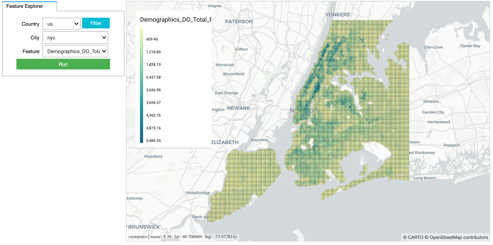
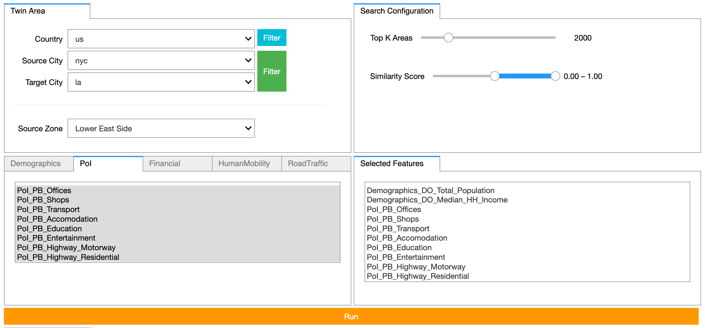
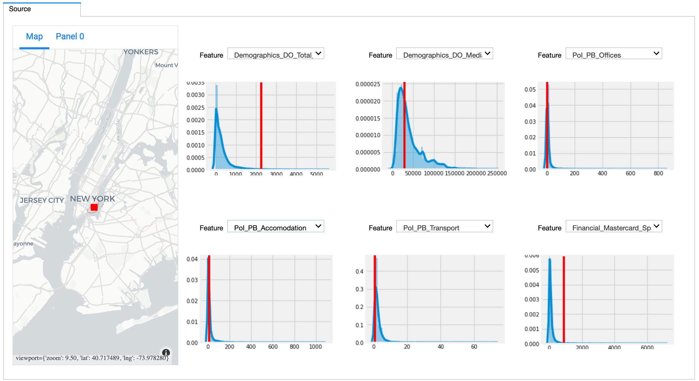
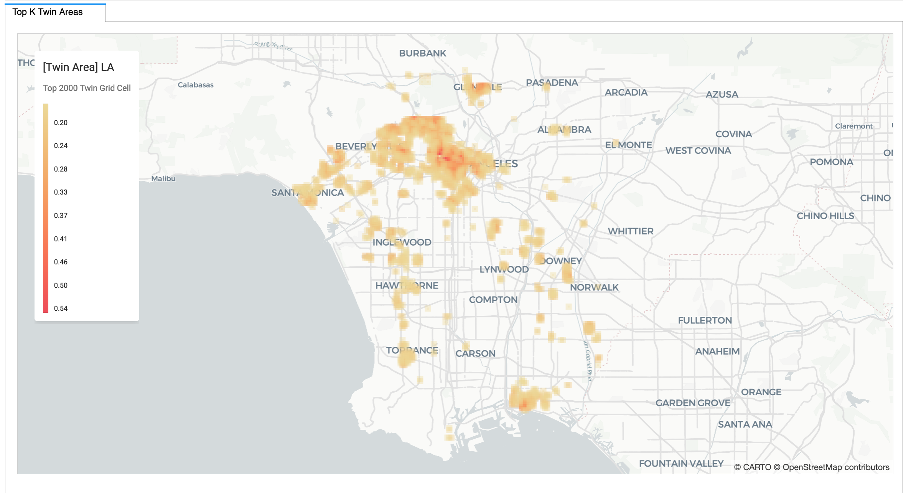
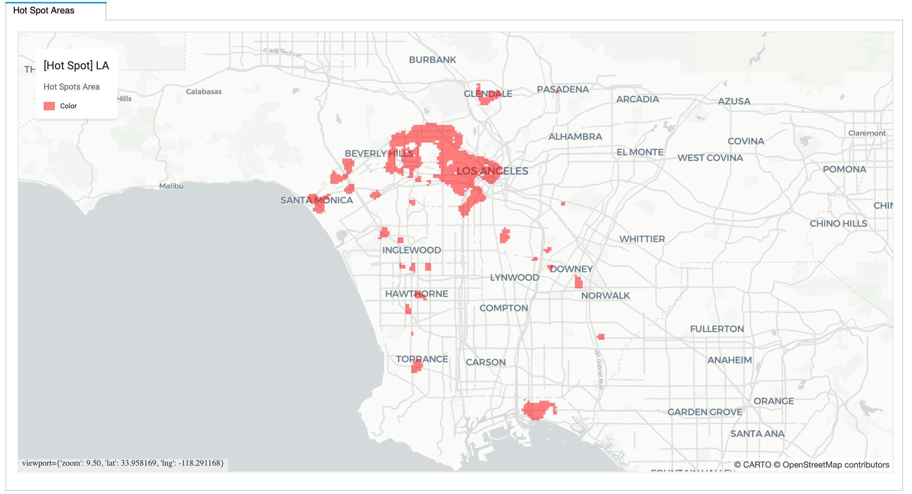

# Twin Area

**Lite Version:**

- Click **`Launch`** 
- Run Every Cell In The Notebook
- Select **Country** -> Click **Filter**
- Select **Source City** &  **Target City** -> Click **Filter**
- Select **Source Zone**
- (Optional) Tune **K** in **Top K Areas** & **Score Range** in **Similarity Score** bar widget
- Select **Feature**(s) which will be taken into consideration in the analysis.
  - Features are classified by different categories in the left tab. And the right tab shows all selected features. 
- Click **Run**

There are three tabs demonstrating the results. 
   1. The first tab shows the Target Neighborhood from Source City as well as histograms of interested features (red line represents the value for the selected neighborhood). Also, the histogram will be updated accordingly as you change the feature in the dropdown widget. If there's no histogram showing up, it means the source zone has Null value for the selected feature. 
   2. The second tab shows the top K Similar (Twin) Areas. 
   3. The third tab shows the result from hotspot analysis. In short, the hotspots mean the areas where grid cells with high similarity scores are concentrated.  

Caveates: 

1. The analysis may take 1-2 minutes for its first run. Since it will cache the similarity scores based on the selected feature set. If you add/delete features, it will start from the beginning and re-compute the scores. Otherwise, if you only change the zones within the saved pair of cities, it will load the cached scores from previous run, which may save plenty of time. 
2. As a Lite version, only keep 10 zones as **Source Zone**(s) for each city (Madrid, Bacelona, NYC & LA). The list is saved in `lite_cities.txt`
3. In terms of the data we are using, POI data for NYC only covers Manhattan, not the whole NYC. we plan to update the data in the near future. 

Tips:

1. Feel free to change the **cartoframes** Map styling inside binder notebook as well as widget layout settings. 
2. Update/Add/Delete Sourc Zone options in `lite_cities.txt` -> Create a branch -> launch a [**Binder**](https://gke.mybinder.org/) from the new branch
3. Due to the limitation of Binder, if the kernel doesn't respond, click `restart kernel` and rerun all cells. 